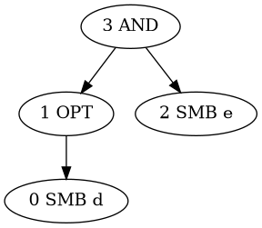
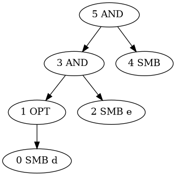
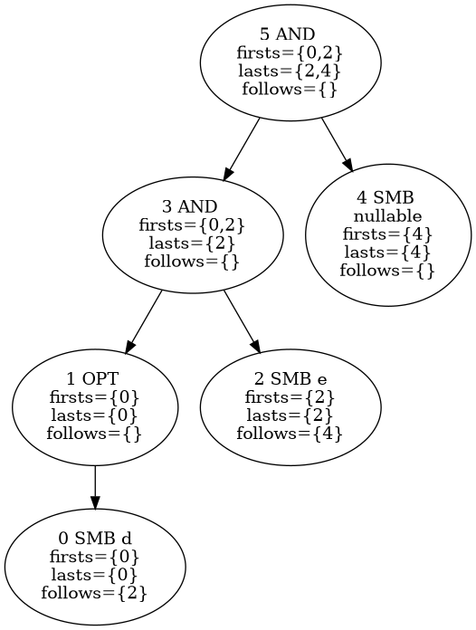
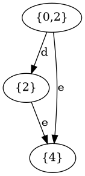

# Some notes on writing a parser generator for a given grammar

A parser generator starts from the text describing the grammar, and
parses it with an ad-hoc parser which determines: 

* meta commands, including whitespace directives
* _Production rules_.

__Production Rules__ are written in BNF format, consisting of a
  _Non-terminal Symbol_ followed by char ':' and multiple
  _Expressions_, separated by char '|', each expression optionally
  carries an _Action_.
  
An __Expression__ consists of a series of _Terminal Symbols_ or
  non-terminal symbols. Expressions are possible matches for the rule.

__Non-terminal Symbol__ are identifiers composed by characters inside
the grammar itself.

__Terminal symbols__ are _Regular Expressions_ that are to be matched
outside the grammar. When the parser is running, terminal symbols are
replaced with _Lexer Token_ that are fed to the parser by the _Lexer_.

## Lexer

Now we come to the __Lexer__, this is a simplified parser which reads
characters and match sequence of them, replacing the given group of
characters with a token. A lexer can be able to determine several
alternative regular expressions. 

The syntax of regexp must be written explicitly, for the time being we
refer to some reference as [this
site](https://compenv.phys.ethz.ch/linux/basics_1/51_posix_regular_expressions/).

Lexer are built by first parsing the regexp strings and building a
corresponding _Absract Syntax Tree_ (AST). Parsing the regexp is carried out
recurring to an ad-hoc parser. The AST consists of nodes which
decides whether to move down or up the tree. Each node has at most two
child nodes, and normally it has one parent node, apart from the main
node which has none. 

A string is matched to a regexp if a path can be found, connecting the
start node to the end node which match the specific expression. 
Nodes in the AST are of the following types:

* Symbol node
  * specifies a set of carachter
  * no subnodes are present
  * if the node is explored, a char in the set must be read from the string.

* "And" node
  * has two subnodes
  * both subnodes must be explored, first the left one, than the right.

* "Or" node
  * has two subnodes
  * one of subnodes must be explored, 
	* first the left one is tried, 
	* than only if the first was not successful, the right is tested.

* Optional node
  * has one subnode
  * the subnode might or might not be explored, in this case only once.

* "Many" node
  * has one subnode
  * the subnode might or might not be explored, as many times as wanted.

* Nonzerotimes node
  * has one subnode
  * the subnode must be explored at least once.

* Action nodes
  * are executed when matched
  * to be understood better.

AST represent the matching in a clar but verbose way, and are
difficult to use in practice, as matching a regexp needes to try all
paths in turn, discarding all the case in which the path is
invalid. This implies rolling back the input stream.

Let us take the example of the AST generated for the regular
expression **"d?e"**:



### AST to NFA

The AST can be converted to a *Nondeterministic Finite Automaton*
([NFA](https://en.wikipedia.org/wiki/Nondeterministic_finite_automaton)),
in which matching is expressed with a cyclic graph. In this
representation, nodes on the graph are opaque descriptors of the state
of the automaton, and all the action is embedded in the edges, which
might match characters, or nothing, in this case they are labelled
with the ε symbol.

While the NFA are more succint than AST, the representation is
difficult to handle as transversing the NFA one needs to take note of
all passed states, and roll back the input stream in case of matching
failure.

In particular, the presence of the ε move make it difficult to predict
if a subgraph will lead to match, leading to a tedious forw and back,
especially in complicated cases,

This is the example of the preceeding AST reformatted as NFA:


### NFA to DFA

The NFA can be more conveniently converted into a *Deterministic
Finite Automaton*
([DFA](https://en.wikipedia.org/wiki/Deterministic_finite_automaton)),
which differ from NFA ought to be designed in such a way to avoid by
construction rolling back the input. This is achieved at the cost of
increasing the number of states of the automaton. In particular a
state in the DFA automaton represents all possible states in which the
NFA can be, given the stream read so far. A number of algorithms
exists, the standard one being the [superset
construction](https://en.wikipedia.org/wiki/Powerset_construction).

The first step is identifying all the states which the automaton can
reach using only ε edges. The set of all these state is the ε-closure
of the automaton, and is the first state of the NFA. In the previous
case this consists of the state `{2,1}`. Then one finds the accepted
input, and draws the evolution of the state according to the input. In
this example one will move to a new state representing state `{1}` if
char "d" is read, or `{0}` if "e" is read. In the first case, the state
accepts the regexp, while in the second case a final move to state `{0}`
is needed.

### AST to DFA

The NFA is actually not needed, and introduces a useless
complication. One can directly build the DFA from the AST. 

#### Augmenting the expression

First of all, the expression is augmented appending a terminal symbl
to mark it as accepted, such that the expression becomes _Important_,
that is, it must match at least one symbol.



#### Nullable, firsts and lasts

Then one determine nullable nodes, which are nodes that can be
skipped. Then first and last nodes (_firsts_ and _lasts_) of the
subtree which must match something. This is done according to the
following rules:

* Symbol node
  * **nullable** if no chapter is accepted
  * **firts** contains only the node itself
  * **lasts** contains only the node itself
  
* "And" node
  * **nullable** if both subnodes are nullable
  * **firsts** is the firsts of the first subnodes, and of the second if
    the first subnode is nullable
  * **lasts**  is the lasts of the second subnodes, and of the first if
    the second subnode is nullable

* "Or" node
  * **nullable** if at least one of the subnodes is nullable
  * **firsts** is the union of the firsts of the two subnodes
  * **lasts** is the union of the lasts of the two subnode
  
* Optional node
  * **nullable** always
  * **firsts** is the firsts of the subnode
  * **lasts** is the lasts of the subnode

* "Many" node
  * **nullable** always
  * **firsts** is the firsts of the subnode
  * **lasts** is the lasts of the subnode

* Nonzerotimes node
  * **nullable** if subnode is nullable
  * **firsts** is the firsts of the subnode
  * **lasts** is the lasts of the subnode

* Action nodes
  * **nullable** never
  * **firsts** contains only the node itself
  * **lasts** contains only the node itself.

#### Follows 

Then, the "follow" positions (follows) are determined. This is done by
computing the follows of the subnodes iteratively. When follows of
subnodes are computed, the follows of the given node are
determined. One considers only "And", "Star" and "Optional" nodes. The
aim is to close the wire and connect the plausbile paths along the
tree:

* "And" nodes: add to the follows of each element of the lasts of the
  first subnode, the firsts of the second subnode
* "Many" and "Nonzerotimes": add the firsts to the follows of all
  lasts which are symbol or action node.

This is the final collection in the case of the regexp at discussion:



#### DFA generation

Finally, the DFA is generated, creating all _Dstates_ iteratively and
all _Transitions_ associated to each dstate. We work on all just
created states. The first dstate created is identified by the firsts
of the principal node of the AST.

Each of the firsts of the state under analysis is associated with a
certain number of characters. The ranges of characters leading to
different firsts are determined, telling apart those which
overlap. For example let's say that the firsts contains states
`{0,3}`, which match respectively `{a,b,c,d}` and `{c,d,e,f}`, one
builds the set of non-overlapping ranges: `{{a,b},{c,d},{e,f}}`. 

This vector of ranges is identified by a list, in which init/end chars
are marked with a flag to specify if the char is the beginning of a
range. This list can be easily built with the following procedure:

* first one mark the extrema of the `0` state, `{{a,true},{d,false}}`
* then, the initial extrema of the `1` state must be inserted, we find
  the point where and we add `{c,true}`, such that the ranges become
  `{{a,true},{c,true},{d,false}}`
* then we find the point where to insert the range end `{f,false}` and
  meantime we mark all the intermediate entries as true:
  `{{a,true},{c,true},{d,true},{f,false}}`.

Then, for each range, the list of states that are accessible is
identified, and all follows are merged, this becomes the identifier of
the next dstate. Action states are not considered at first, and are
included in the dstate identification only if no other state is
present.

If the next dstate exists, a transition is added to the transitions
list, and possible action is coupled to the transition. If the state
matches a full string, the string is attached to the dstate. If
multiple tokens match, a conflict is raised.




An interesting visual implementation is presented here: [visual
representation RE to DFA](http://cgosorio.es/Seshat/ahoSethiUllman "Re
to DFA visual implementation").

### The ad-hoc parser
This is really the horrible part, let's see

* parse
  * match\_or_expression
	* match\_cat_expression
		* match\_postfix_expression
			* match\_character\_expression: match_character()
				* add a char node
				* match("*"): make the last node an "many" node
				* match("+"): make the last node a "nonzero" node
				* match("?"): make the last node an "optional" node
		* match\_cat_expression
		* add "and" node to the parse tree
   	* match("|")
	* match\_or_expression
	* add "or" node to the parse tree
		
* match("string"): create a copy of the cursor, and move it forward if
  matching. If the matched char is \0 put the cursor at the end of the
  matched string
		
* match_character(): match everything which is not |*+?

We can rephrase it like this:

We start with a cursor at the beginning of the string to be parsed. An
empty list of nodes.

* parse
  * matchAndAddPossiblyOrredExpr
	* matchAndAddPossiblyAndedExpr
		* matchAndAddPossiblyPostfixedExpr
			* matchAndAddCharExpr
				* matchAllCharsBut("|*+?")
				* addCharNode
				* matchAndAddPostfix
			* matchAndAddAndedSecondExpr
		* matchAndAddOrredSecondExpr

 * matchAllCharsBut(string): if the char pointed by the cursor is not
   in the string, and it's not at the end, advance by 1, put the
   matched interval around the chars, and returns true; else
   otherwise.

* addCharNode: add a new node, with the char at the beginning of the
   matched interval as the only possible accepted one

* matchAndAddPostfix: 
   * matchCharAndMoveAsSubNode('*',MANY)
   * or, matchCharAndMoveAsSubNode('+',NON_ZERO)
   * or, matchCharAndMoveASSubNode('?',OPTIONAL)
   * return whether one was successuful
   
 * matchCharAndMoveAsSubNode(char,type,n=1):
   * match(char)
   * moveAsSubNode(type,n)

 * moveAsSubNode(type,n=1):
   * create a new node, of the given type
   * move the last n nodes as a subnode of the new one
   * returns whether successful
   
 * matchAndAddAndedSecondExpr:
   * matchAndAddPossiblyAndedExpr
   * moveAsSubNode(AND,2) 
   
 * matchAndAddOrredSecondExpr:
   * match("|")
   * matchAndAddPossiblyOrredExpr
   * moveAsSubNode(OR,2)
   
### Greedy

Normally the lexer behaves greedly, that is, it tries to match as much
as possible e.g if a lexer can detect "vita" "mina" and "vitamina" it
will match "vitamina" and not the two other words separately, in
presence of the input "vitamina". 

### Precedence

If multiple regexp of the same length are matched, the first defined
is matched.


## Two step compilation

The parser is generated in two steps. 

* At first step, the parser is built in a non-constant sized
  structure, which is used to estimate the required table sizes.
* On this basis, the needed fixed-size structure parser is provided,
 and used to store the parser, which is built again.
 
 This requires to generate the parser twice, is not super-elegant but
 is sustainable. This is needed because the fixed-size structure can
 be created only after the estimate of the size is available as a
 constexpr. This requires the size of the non-constant parser to be
 returned from the parser generator routine, in place of the
 non-constant parser itself, which would not be a constexpr. This
 implies that the non-constant parser is destroyed as it is not
 returned, hence it must be reconstructed.
 
 The procedure is illustrated in the following example:

```c++
template <size_t N=0>
constexpr auto get(const std::string_view& str)
{
  if constexpr(N==0)
    return str.size();
  else
    {
      std::array<char,N> res;
      std::copy(str.begin(),str.end(),res.begin());
      return res;
    }
}

void test()
{
  constexpr char str[]="ciao!";
  constexpr auto strArr=get<get(str)>(str);
  static_assert(strArr[0]=='c');
}
```
